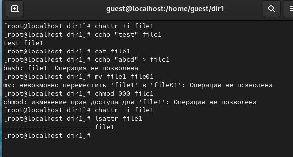

---
## Front matter
title: "Отчёт по лабораторной работе №4"
subtitle: "Дисциплина: Основы информационной безопасности"
author: "Дудырев Глеб Андреевич НПИбд-01-22"

## Generic otions
lang: ru-RU
toc-title: "Содержание"

## Bibliography
bibliography: bib/cite.bib
csl: pandoc/csl/gost-r-7-0-5-2008-numeric.csl

## Pdf output format
toc: true # Table of contents
toc-depth: 2
lof: true # List of figures
lot: true # List of tables
fontsize: 12pt
linestretch: 1.5
papersize: a4
documentclass: scrreprt
## I18n polyglossia
polyglossia-lang:
  name: russian
polyglossia-otherlangs:
  name: english
## I18n babel
babel-lang: russian
babel-otherlangs: english
## Fonts
mainfont: Arial
romanfont: Arial
sansfont: Arial
monofont: Arial
mainfontoptions: Ligatures=TeX
romanfontoptions: Ligatures=TeX
sansfontoptions: Ligatures=TeX,Scale=MatchLowercase
monofontoptions: Scale=MatchLowercase,Scale=0.9
## Biblatex
biblatex: true
biblio-style: "gost-numeric"
biblatexoptions:
  - parentracker=true
  - backend=biber
  - hyperref=auto
  - language=auto
  - autolang=other*
  - citestyle=gost-numeric
## Pandoc-crossref LaTeX customization
figureTitle: "Рис."
tableTitle: "Таблица"
listingTitle: "Листинг"
lofTitle: "Список иллюстраций"
lotTitle: "Список таблиц"
lolTitle: "Листинги"
## Misc options
indent: true
header-includes:
  - \usepackage{indentfirst}
  - \usepackage{float} # keep figures where there are in the text
  - \floatplacement{figure}{H} # keep figures where there are in the text
---

# Цель работы

Получение практических навыков работы в консоли с расширенными атрибутами файлов.

# Выполнение лабораторной работы

1. От пользователя guest определяю расширенные атрибуты файла /home/guest/dir1/file1 командой */lsattr /home/guest/dir1/file1*. Далее, устанавливаю командой *chmod 600 file1* на файл file1 права, разрешающие чтение и запись для владельца файла. Пробую установить расширенный атрибут a от имени пользователя guest командой *chattr +a /home/guest/dir1/file1* (рис. [-@fig:001])

{ #fig:001 width=70% }

2. Пробую установить расширенный атрибут a от имени суперпользователя  командой *chattr +a /home/guest/dir1/file1* (рис. [-@fig:002])

{ #fig:002 width=70% }

3. Проверяю правильность установления атрибута командой *lsattr /home/guest/dir1/file1* (рис. [-@fig:003])

{ #fig:003 width=70% }

4. Выполняю дозапись в файл file1 слова «test» командой *echo "test" /home/guest/dir1/file1*. После этого, выполняю чтение файла file1 командой *cat /home/guest/dir1/file1* - слово не записалось (рис. [-@fig:004])

{ #fig:004 width=70% }

5. Пробую удалить файл file1 либо стереть имеющуюся в нём информацию командой *echo "abcd" > /home/guest/dirl/file1*. Далее, пробую переименовать файл командой *mv*, операция не позволена (рис. [-@fig:005])

{ #fig:005 width=70% }

6. С помощью команды *chmod 000 file1* установить на файл file1 права - операция не позволена (рис. [-@fig:006])

{ #fig:006 width=70% }

7. Снимаю расширенный атрибут a с файла /home/guest/dirl/file1 от
имени суперпользователя командой *chattr -a /home/guest/dir1/file1* и снова пробую изменить права доступа - теперь успешно (рис. [-@fig:007])

{ #fig:007 width=70% }

8. Заменяю расширенный атрибут a на атрибут i командой *chattr +i /home/guest/dir1/file1*. Проделываю те же действия. (рис. [-@fig:008])

{ #fig:008 width=70% }

# Выводы

В результате выполнения работы я повысил свои навыки использования интерфейса командой строки (CLI), познакомился на примерах с тем, как используются основные и расширенные атрибуты при разграничении доступа. Имел возможность связать теорию дискреционного разделения доступа (дискреционная политика безопасности) с её реализацией на практике в ОС Linux
