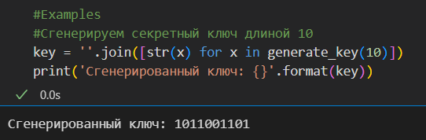
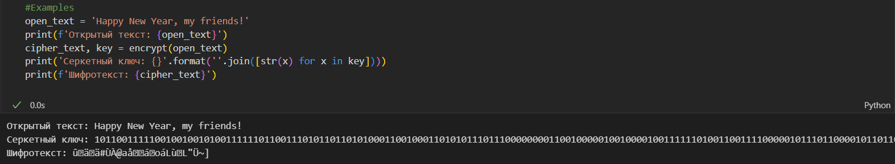
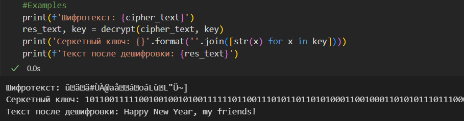
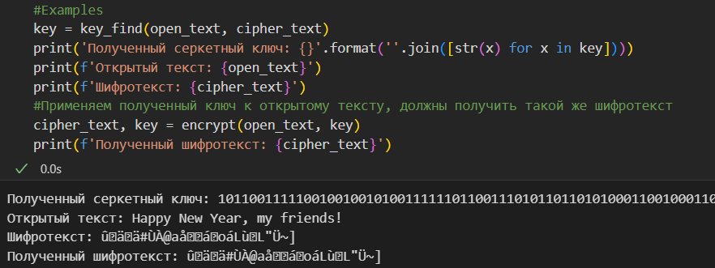

---
## Front matter
lang: ru-RU
title: Лабораторная Работа №9.
subtitle: Основы информационной безопасности
author:
  - Дудырев Г.А.
institute:
  - Российский университет дружбы народов им. Патриса Лумумбы, Москва, Россия

## i18n babel
babel-lang: russian
babel-otherlangs: english

## Formatting pdf
toc: false
toc-title: Содержание
slide_level: 2
aspectratio: 169
section-titles: true
theme: metropolis
header-includes:
 - \metroset{progressbar=frametitle,sectionpage=progressbar,numbering=fraction}
 - '\makeatletter'
 - '\beamer@ignorenonframefalse'
 - '\makeatother'

## Fonts
mainfont: Arial
romanfont: Arial
sansfont: Arial
monofont: Arial
---


## Докладчик


  * Дудырев Глеб Андреевич
  * НПИбд-01-22
  * Российский университет дружбы народов
  * [1132222003@pfur.ru]
  * <https://github.com/GlebDudyrev>
  
# Цель работы

Освоить на практике применение режима однократного гаммирования1

# Выполнение лабораторной работы

## Функция generate_key

Для начала реализую функцию generate_key, которая генерирует случайнную последовательность бит, то есть секретный ключ.

```Python
  def generate_key(key_len: int) -> list:
    """
        Функция генерирует пвсевдослучайную последовательность, 
        которая будет использоваться в качестве ключа для шифрования.
    """
    key = [] #Объект, который будет содержать итоговую последовательность
    for i in range(key_len):
        #Генерируем последовательность
        key.append(np.random.randint(0, 2))
    return key
```
## Функция generate_key

Посмотрим на результат работы generate_key():



## Функция encrypt

Далее я реализую функцию encrypt, которая производит шифрование открытого текста, с помощью применения однократного кодирования. 

```Python
  def encrypt(open_text: str, key: list = None) -> str:
    """
        Функция шифрует данные в режиме однократного гаммирования.
    """
    #Из открытого текста получаем бинарную последовательность
    open_text_bin = ''.join(format(ord(x), '08b') for x in open_text)
    #Если ключ не передается, то сгенерируем его
    if not key:
        key_len = len(open_text_bin)
        key = generate_key(key_len)
    #Получаем последовательность бит шифротекста, применяя последовательно XOR к биту из открытого текста и  соответсвующему биту из  секретного ключа
    ciphertext_bin = []
    for idx, bit in enumerate(open_text_bin):
        ciphertext_bin.append(int(bit) ^ key[idx])
    ciphertext_bin = ''.join([str(x) for x in ciphertext_bin])
    #Преобразуем последовательность бит в текст
    ciphertext = ''.join(chr(int(ciphertext_bin[(i * 8):(i * 8 + 8)],2)) for i in range(len(ciphertext_bin) // 8))
    return ciphertext, key
```

## Функция encrypt

Посмотрим на пример работы этой функции:



## Функция decrypt

Следующим шагом я реализовал функцию, которая призводит дешифрования шифротекста.

```Python
  def decrypt(cipher_text: str, key) -> str:
    """
        Функция, которая производит дешифрование
    """
    if not key: #Если ключ не передали, то завершаем работу программы
        return 'You should enter the secret key.'
    #Из зашифрованного текста получаем бинарную последовательность
    cipher_text_bin = ''.join(format(ord(x), '08b') for x in cipher_text)
    #Получаем последовательность бит открытого текста, применяя последовательно XOR к биту из шифротекста и соответсвующему биту из секретного ключа
    open_text_bin = []
    for idx, bit in enumerate(cipher_text_bin):
        open_text_bin.append(int(bit) ^ key[idx])
    open_text_bin = ''.join([str(x) for x in open_text_bin])
    #Преобразуем последовательность бит в текст
    open_text = ''.join(chr(int(open_text_bin[(i * 8):(i * 8 + 8)],2)) for i in range(len(open_text_bin) // 8))
    return open_text, key
```

## Функция decrypt

Посмотрим на пример ее работы:



## Функция key_find

Далее было необходимо реализовать функцию, которая сможет определить секретный ключ по известным открытому и шифро текстам.

```Python
  def key_find(open_text: str, cipher_text: str) -> list:
    #Приводим открытый и шифро тексты к бинарному виду
    cipher_text_bin = ''.join(format(ord(x), '08b') for x in cipher_text)
    open_text_bin = ''.join(format(ord(x), '08b') for x in open_text)
    #Подбираем секретный ключ применяя XOR операцию к последовательностям битов открытого и шифро текстов
    key = []
    for idx, open_bit in enumerate(open_text_bin):
        key.append(int(cipher_text_bin[idx]) ^ int(open_bit))
    
    res_cipher_text, key = encrypt(open_text, key)
    assert res_cipher_text == cipher_text    
    #Возвращаем получившийся текст
    return key
```

## Функция key_find

То, как она работает:




# Выводы

Я узнал о схеме однократного гаммирования и научился ее применять на практике