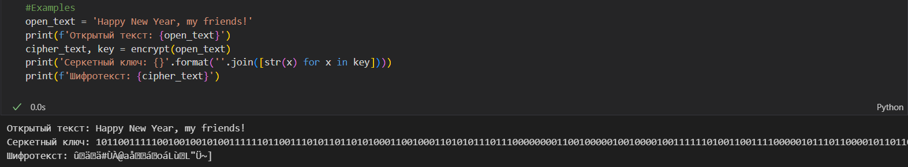

---
## Front matter
title: "Отчёт по лабораторной работе №7"
subtitle: "Дисциплина: Основы информационной безопасности"
author: "Дудырев Глеб Андреевич"

## Generic otions
lang: ru-RU
toc-title: "Содержание"

## Bibliography
bibliography: bib/cite.bib
csl: pandoc/csl/gost-r-7-0-5-2008-numeric.csl

## Pdf output format
toc: true # Table of contents
toc-depth: 2
lof: true # List of figures
lot: true # List of tables
fontsize: 12pt
linestretch: 1.5
papersize: a4
documentclass: scrreprt
## I18n polyglossia
polyglossia-lang:
  name: russian
polyglossia-otherlangs:
  name: english
## I18n babel
babel-lang: russian
babel-otherlangs: english
## Fonts
mainfont: Arial
romanfont: Arial
sansfont: Arial
monofont: Arial
mainfontoptions: Ligatures=TeX
romanfontoptions: Ligatures=TeX
sansfontoptions: Ligatures=TeX,Scale=MatchLowercase
monofontoptions: Scale=MatchLowercase,Scale=0.9
## Biblatex
biblatex: true
biblio-style: "gost-numeric"
biblatexoptions:
  - parentracker=true
  - backend=biber
  - hyperref=auto
  - language=auto
  - autolang=other*
  - citestyle=gost-numeric
## Pandoc-crossref LaTeX customization
figureTitle: "Рис."
tableTitle: "Таблица"
listingTitle: "Листинг"
lofTitle: "Список иллюстраций"
lotTitle: "Список таблиц"
lolTitle: "Листинги"
## Misc options
indent: true
header-includes:
  - \usepackage{indentfirst}
  - \usepackage{float} # keep figures where there are in the text
  - \floatplacement{figure}{H} # keep figures where there are in the text
---

# Цель работы

Освоить на практике применение режима однократного гаммирования1

# Выполнение лабораторной работы

1. Для начала реализую функцию generate_key, которая генерирует случайнную последовательность бит, то есть секретный ключ.

```Python
  def generate_key(key_len: int) -> list:
    """
        Функция генерирует пвсевдослучайную последовательность, 
        которая будет использоваться в качестве ключа для шифрования.
    """
    key = [] #Объект, который будет содержать итоговую последовательность
    for i in range(key_len):
        #Генерируем последовательность
        key.append(np.random.randint(0, 2))
    return key
```

Посмотрим на результат работы generate_key():(рис. [-@fig:001])

{ #fig:001 width=70% }

2. Далее я реализую функцию encrypt, которая производит шифрование открытого текста, с помощью применения однократного кодирования. 

```Python
  def encrypt(open_text: str, key: list = None) -> str:
    """
        Функция шифрует данные в режиме однократного гаммирования.
    """
    #Из открытого текста получаем бинарную последовательность
    open_text_bin = ''.join(format(ord(x), '08b') for x in open_text)
    #Если ключ не передается, то сгенерируем его
    if not key:
        key_len = len(open_text_bin)
        key = generate_key(key_len)
    #Получаем последовательность бит шифротекста, применяя последовательно XOR к биту из открытого текста и  соответсвующему биту из  секретного ключа
    ciphertext_bin = []
    for idx, bit in enumerate(open_text_bin):
        ciphertext_bin.append(int(bit) ^ key[idx])
    ciphertext_bin = ''.join([str(x) for x in ciphertext_bin])
    #Преобразуем последовательность бит в текст
    ciphertext = ''.join(chr(int(ciphertext_bin[(i * 8):(i * 8 + 8)],2)) for i in range(len(ciphertext_bin) // 8))
    return ciphertext, key
```

Посмотрим на пример работы этой функции: (рис. [-@fig:002])

{ #fig:002 width=70% }

3. Следующим шагом я реализовал функцию, которая призводит дешифрования шифротекста.

```Python
  def decrypt(cipher_text: str, key) -> str:
    """
        Функция, которая производит дешифрование
    """
    if not key: #Если ключ не передали, то завершаем работу программы
        return 'You should enter the secret key.'
    #Из зашифрованного текста получаем бинарную последовательность
    cipher_text_bin = ''.join(format(ord(x), '08b') for x in cipher_text)
    #Получаем последовательность бит открытого текста, применяя последовательно XOR к биту из шифротекста и соответсвующему биту из секретного ключа
    open_text_bin = []
    for idx, bit in enumerate(cipher_text_bin):
        open_text_bin.append(int(bit) ^ key[idx])
    open_text_bin = ''.join([str(x) for x in open_text_bin])
    #Преобразуем последовательность бит в текст
    open_text = ''.join(chr(int(open_text_bin[(i * 8):(i * 8 + 8)],2)) for i in range(len(open_text_bin) // 8))
    return open_text, key
```

Посмотрим на пример ее работы: (рис. [-@fig:003])

{ #fig:003 width=70% }

4. Далее было необходимо реализовать функцию, которая сможет определить секретный ключ по известным открытому и шифро текстам.

```Python
  def key_find(open_text: str, cipher_text: str) -> list:
    #Приводим открытый и шифро тексты к бинарному виду
    cipher_text_bin = ''.join(format(ord(x), '08b') for x in cipher_text)
    open_text_bin = ''.join(format(ord(x), '08b') for x in open_text)
    #Подбираем секретный ключ применяя XOR операцию к последовательностям битов открытого и шифро текстов
    key = []
    for idx, open_bit in enumerate(open_text_bin):
        key.append(int(cipher_text_bin[idx]) ^ int(open_bit))
    
    res_cipher_text, key = encrypt(open_text, key)
    assert res_cipher_text == cipher_text    
    #Возвращаем получившийся текст
    return key
```

То, как она работает: (рис. [-@fig:004])

{ #fig:004 width=70% }


# Выводы

Я узнал о схеме однократного гаммирования и научился ее применять на практике