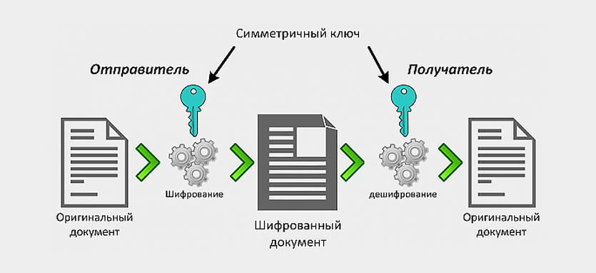
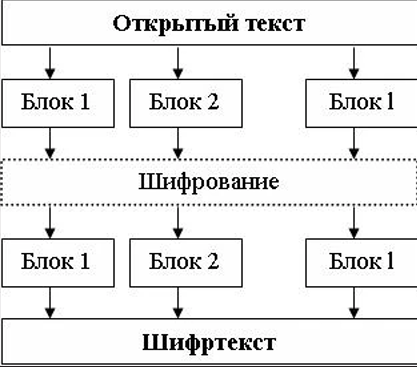
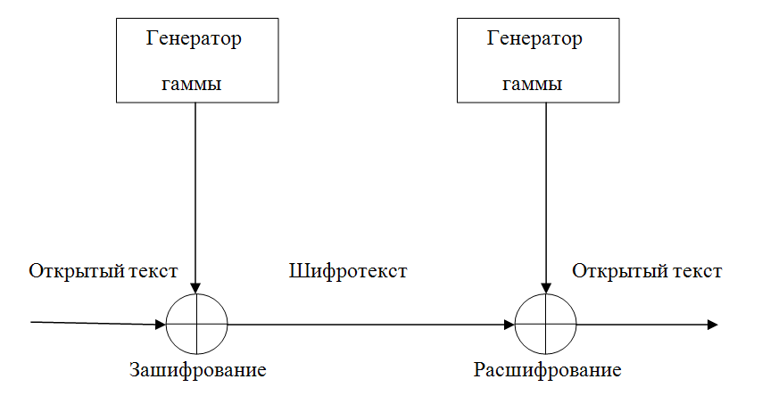
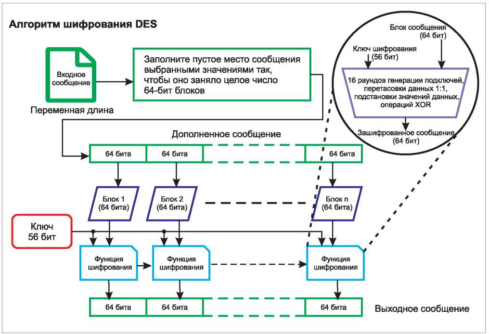
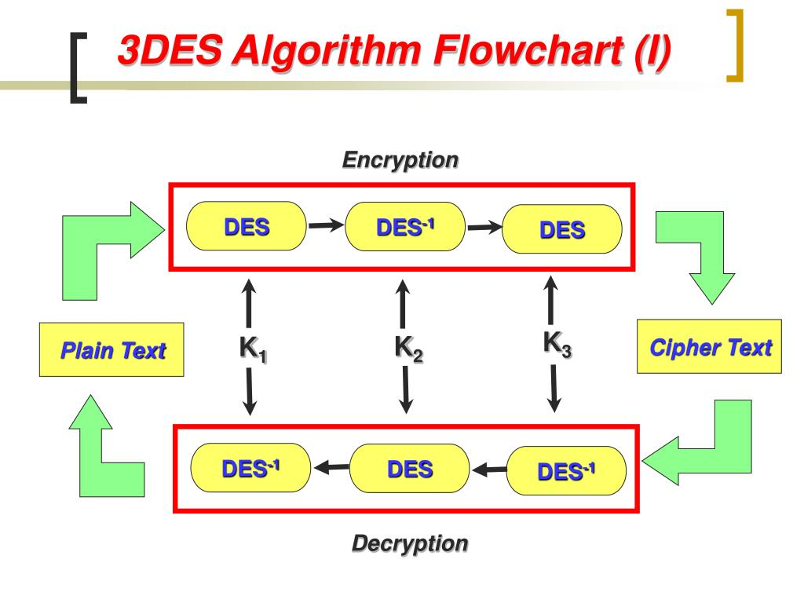
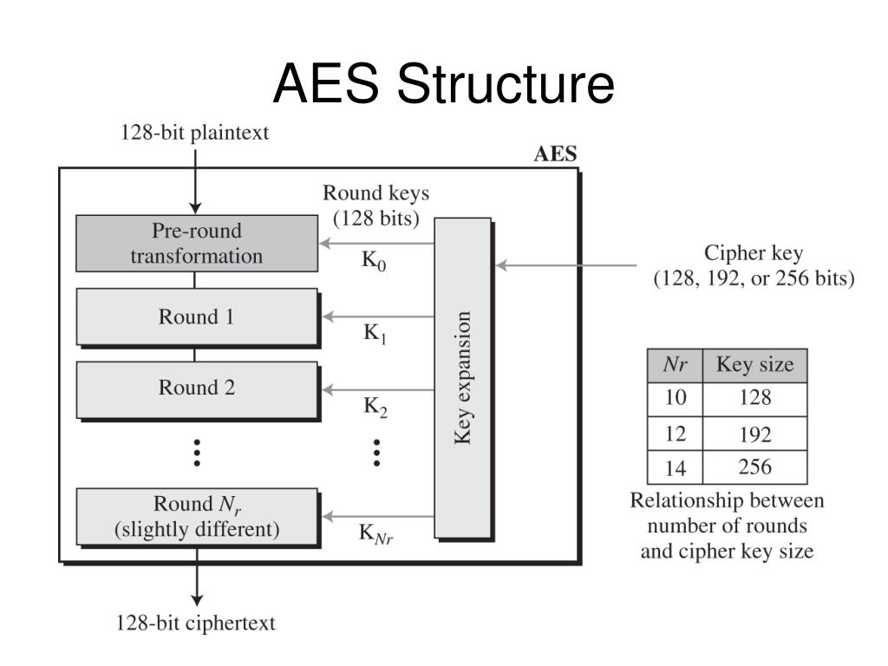
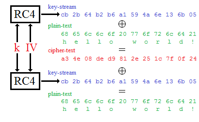
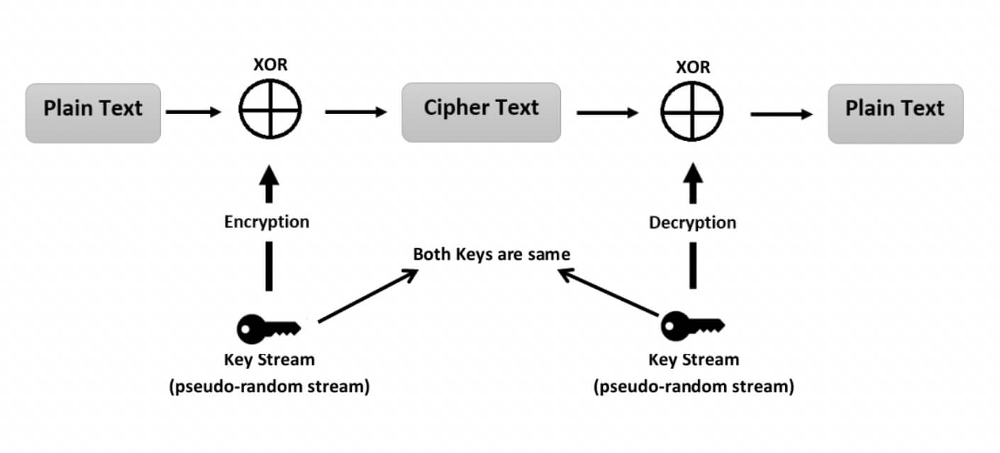

---
## Front matter
lang: ru-RU
title: Симметричные криптосистемы 
subtitle: Основы информационной безопасности
author:
  - Дудырев Г.А.
institute:
  - Российский университет дружбы народов им. Патриса Лумумбы, Москва, Россия

## i18n babel
babel-lang: russian
babel-otherlangs: english

## Formatting pdf
toc: false
toc-title: Содержание
slide_level: 2
aspectratio: 169
section-titles: true
theme: metropolis
header-includes:
 - \metroset{progressbar=frametitle,sectionpage=progressbar,numbering=fraction}
 - '\makeatletter'
 - '\beamer@ignorenonframefalse'
 - '\makeatother'

## Fonts
mainfont: Arial
romanfont: Arial
sansfont: Arial
monofont: Arial
---

## Докладчик

  * Дудырев Глеб Андреевич
  * НПИбд-01-22
  * Российский университет дружбы народов
  * [1132222003@pfur.ru]
  * <https://github.com/GlebDudyrev>
  
## Цель

Целью данного доклада заключается в изучении симметричных криптосистем, необходимо понять, что такое симметричные криптосистемы, как они работают и каких видов бывают. Рассмотреть наиболее популярные алгоритмы симметричных криптосистем, а также посмотреть какие атаки на подобные системы существуют.

## Введение

Симметричные криптосистемы, также известные как секретные криптосистемы, представляют собой криптографические алгоритмы, которые используют один и тот же секретный ключ как для шифрования, так и для дешифрования.Они широко используются для защиты конфиденциальных данных в различных приложениях, в том числе:

- Шифрование данных в транзите (например, сетевая связь, передача файлов)
- Шифрование данных в состоянии покоя (например, шифрование базы данных, шифрование файлов)
- Цифровые подписи (в сочетании с хэш -функцией)

## Принцип работы симметричных алгоритмов шифрования

Симметричным можно считать любой шифр, который использует один секретный ключ для шифрования и расшифрования данных. 

## Принцип работы симметричных алгоритмов шифрования

Например, если мы хотим передать зашифрованное сообщение нашему другу, то вместе с этим сообщением по защищенному каналу нам необходимо будет передать секретный ключ(например таблицу, ставящую в соответсвие одному символу другой) с помощью которого мы зашифровали наше сообщение, чтобы друг смог получить исходный текст. Важно отметить, чтобы получатель смог воспользоваться секретным ключом, он должен знать **алгоритм шифрования**, который использовал отправитель.

## Классические примеры симметричных алгоритмов шифрования

Классическими примерами  симметричных криптографических алгоритмов, являются:

- Простая перестановка
- Одиночная перестановка по ключу
- Двойная перестановка
- Перестановка «Магический квадрат»

# Виды симметричных криптосистем

Симметричные алгоритмы разделяют на два вида: блочные и потоковые шифры.

## Блочные криптосистемы

Блочные алгоритмы шифруют данные блоками фиксированной длины (64, 128 или другое количество бит в зависимости от алгоритма). Если все сообщение или оставшаяся часть меньше длины блока, то сообщение дополняется предустмотренными алгоритмом символами, которые называются дополнением.

## Блочные криптосистемы

## Блочные криптосистемы

Наиболее известными алгоритмами этого класса являются:

- AES
- DES
- 3DES

У блочных алгоритмов существуют различные режимы работы, такие как:

- ECB (Electronic Codebook)
- CBC (Cipher Block Chaining):
- CFB (Cipher Feedback):
- OFB (Output Feedback):

## Потоковые шифры

Потоковое шифрование данных предполагает обработку каждого бита информации с использованием гаммирования, то есть изменения этого бита с помощью соответствующего ему бита псевдослучайной секретной последовательности чисел, которая формируется на основе ключа и имеет ту же длину, что и шифруемое сообщение.

## Потоковые шифры

# Популярные симметричные алгоритмы

## DES

DES был разработан IBM в 1970-х годах по заказу Национального бюро стандартов США. Его принятие в качестве официального стандарта шифрования в 1977 году было важной вехой в развитии криптографии.

## DES

## 3DES

3DES был разработан в качестве ответа на растущую уязвимость оригинального DES алгоритма. Основная идея заключалась в том, чтобы увеличить длину ключа и, соответственно, криптографическую стойкость шифра.

## 3DES

## AES

AES был выбран в качестве нового стандарта симметричного блочного шифрования, чтобы заменить устаревающий DES и 3DES. Этот выбор был сделан Национальным институтом стандартов и технологий (NIST) в 2001 году после обширного процесса оценки и тестирования различных кандидатов.

## AES

## RC4

RC4 (Rivest Cipher 4) - это потоковый шифр, который был разработан Роном Ривестом для компании RSA Data Security (ныне RSA Security) в 1987 году. Шифр был секретным до тех пор, пока в 1994 году не был анонимно опубликован в интернете, после чего он получил широкое распространение.

## RC4

## ChaCha20

ChaCha20 – это высокопроизводительный потоковый шифр, разработанный криптографом Даниэлем Бернштейном. ChaCha20 представляет собой эволюцию другого его шифра Salsa20 и является одним из немногих потоковых шифров, которые рекомендуются к использованию на сегодняшний день.

## ChaCha20

## Способы атак на симметричные криптосистемы

Симметричные криптосистемы, хотя и являются важными инструментами для обеспечения конфиденциальности и целостности данных, имеют ряд уязвимостей, которые могут быть использованы злоумышленниками для атак.

## Способы атак на симметричные криптосистемы

## Заключение

В заключение доклада о симметричных криптосистемах можно сказать, что эти системы играют ключевую роль в обеспечении цифровой безопасности и конфиденциальности на современном этапе развития информационных технологий.

## Список литературы

[1. Шенец Н. Н. Криптографические методы защиты информации. Симметричные криптосистемы: учебное пособие для студентов высших учебных заведений, обучающихся по УГСН 10.00. 00 «Информационная безопасность» по программам подготовки бакалавров, магистров, специалистов. – 2022. URL: https://elib.spbstu.ru/dl/2/i22-282.pdf/info (дата обращения: 03.05.2024).](https://elib.spbstu.ru/dl/2/i22-282.pdf/info)

## Список литературы

[2. Тимофеев А. М. Симметричные криптосистемы: стандарт DES. Лабораторный практикум: учебно-методическое пособие. – 2024. URL: https://ru.wikipedia.org/wiki/Блочный_шифр (дата обращения: 03.05.2024).](https://libeldoc.bsuir.by/handle/123456789/55366)

[3. Берников Владислав Олегович Сравнительный анализ криптостойкости симметричных алгоритмов шифрования // Труды БГТУ. Серия 3: Физико-математические науки и информатика. 2020. №1 (230). URL: https://cyberleninka.ru/article/n/sravnitelnyy-analiz-kriptostoykosti-simmetrichnyh-algoritmov-shifrovaniya (дата обращения: 03.05.2024).](https://cyberleninka.ru/article/n/sravnitelnyy-analiz-kriptostoykosti-simmetrichnyh-algoritmov-shifrovaniya)
