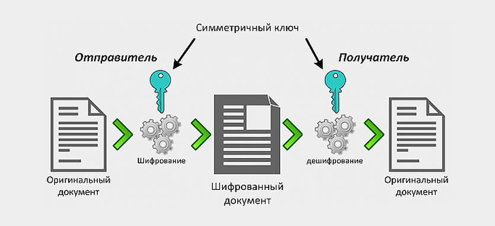
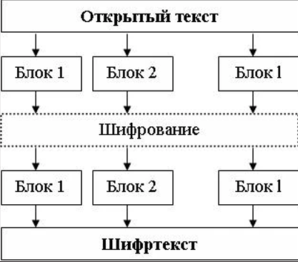
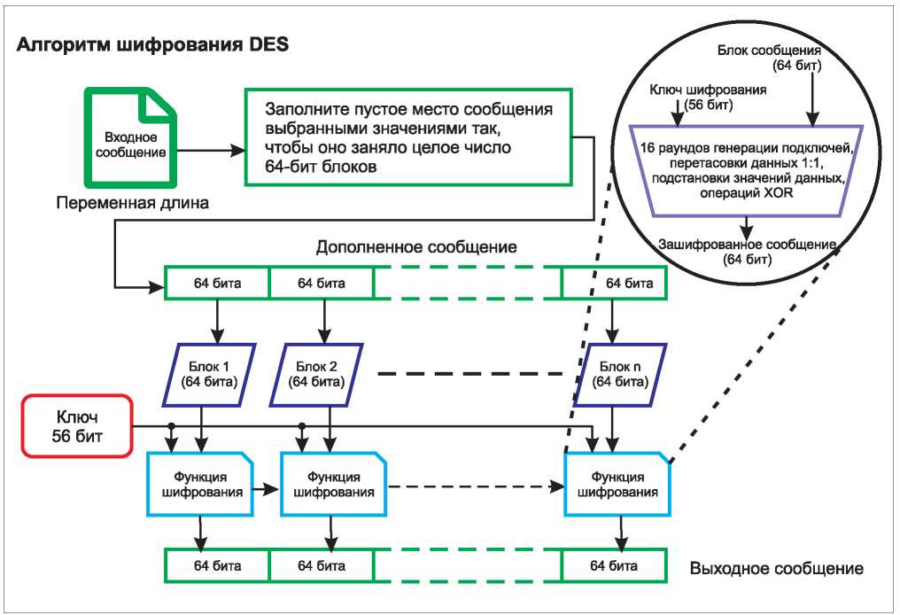
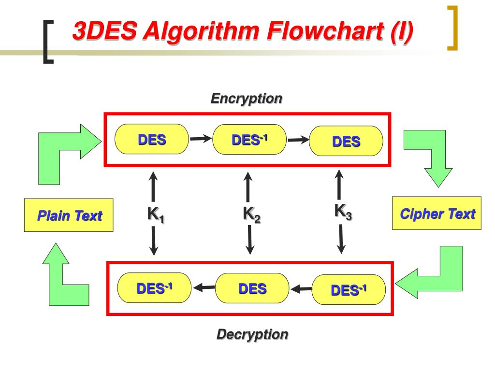
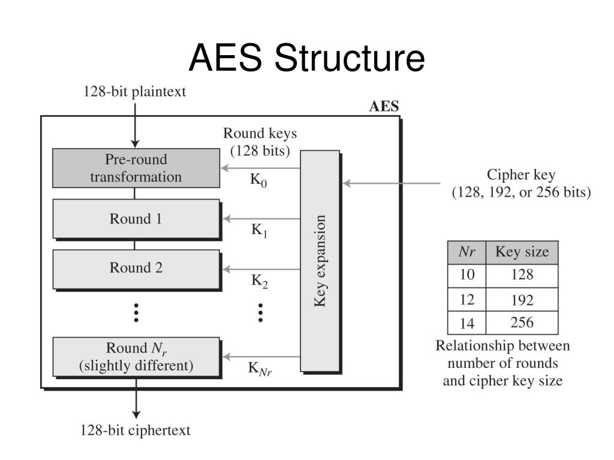
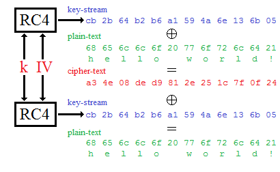
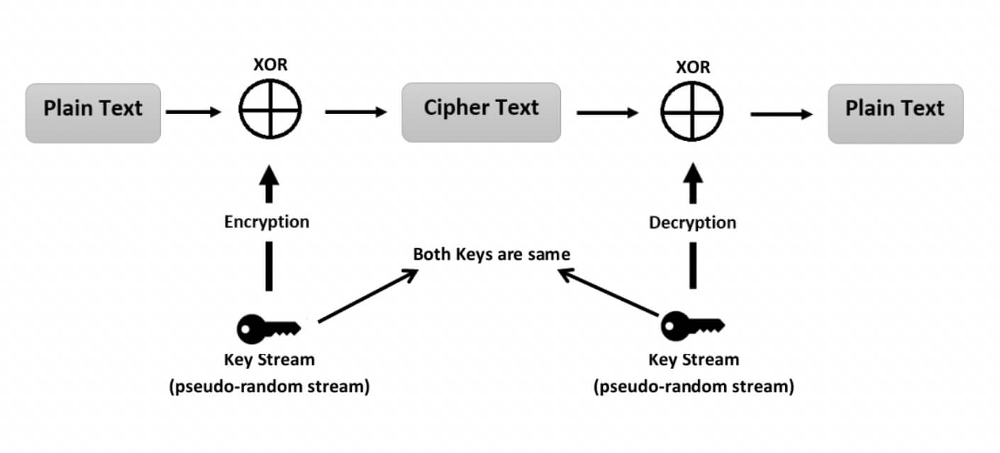

---
## Front matter
title: "Доклад на тему: Симметричные криптосистемы"
subtitle: "Дисциплина: Основы компьютерной безопасности"
author: "Дудырев Глеб Андреевич"

## Generic otions
lang: ru-RU
toc-title: "Содержание"

## Bibliography
bibliography: ./bib/cite.bib
csl: pandoc/csl/gost-r-7-0-5-2008-numeric.csl

## Pdf output format
toc: true # Table of contents
toc-depth: 2
lof: true # List of figures
lot: true # List of tables
fontsize: 12pt
linestretch: 1.5
papersize: a4
documentclass: scrreprt
## I18n polyglossia
polyglossia-lang:
  name: russian
polyglossia-otherlangs:
  name: english
## I18n babel
babel-lang: russian
babel-otherlangs: english
## Fonts
mainfont: Arial
romanfont: Arial
sansfont: Arial
monofont: Arial
mainfontoptions: Ligatures=TeX
romanfontoptions: Ligatures=TeX
sansfontoptions: Ligatures=TeX,Scale=MatchLowercase
monofontoptions: Scale=MatchLowercase,Scale=0.9
## Biblatex
biblatex: true
biblio-style: "gost-numeric"
biblatexoptions:
  - parentracker=true
  - backend=biber
  - hyperref=auto
  - language=auto
  - autolang=other*
  - citestyle=gost-numeric
## Pandoc-crossref LaTeX customization
figureTitle: "Рис."
tableTitle: "Таблица"
listingTitle: "Листинг"
lofTitle: "Список иллюстраций"
lotTitle: "Список таблиц"
lolTitle: "Листинги"
## Misc options
indent: true
header-includes:
  - \usepackage{indentfirst}
  - \usepackage{float} # keep figures where there are in the text
  - \floatplacement{figure}{H} # keep figures where there are in the text
---
# Введение

Симметричная криптография - это класс криптографических систем использующих один и тот же криптографический ключ для шифрования и расшифровки данных. Основным принципом работы является преобразование открытого текста в шифротекст с помощью ключа и обратное преобразование для получения первоначальных данных.

История симметричных шифров берет начало с древних времен, когда использовались простые методы перестановки и замены символов. Однако современная симметричная криптография зародилась в 1970-х годах с появлением алгоритма DES.

# Принцип работы симметричных алгоритмов

## Описание принципа работы

Симметричным можно считать любой шифр, который использует один секретный ключ для шифрования и расшифрования данных. (рис. [-@fig:001])

{ #fig:001 width=70% }

Например, если мы хотим передать зашифрованное сообщение нашему другу, то вместе с этим сообщением по защищенному каналу нам необходимо будет передать секретный ключ(например таблицу, ставящую в соответсвие одному символу другой) с помощью которого мы зашифровали наше сообщение, чтобы друг смог получить исходный текст. Важно отметить, чтобы получатель смог воспользоваться секретным ключом, он должен знать **алгоритм шифрования**, который использовал отправитель.

## Классические примеры симметричных алгоритмов шифрования

Классическими примерами таких алгоритмов являются симметричные криптографические алгоритмы, перечисленные ниже:

- Простая перестановка
- Одиночная перестановка по ключу
- Двойная перестановка
- Перестановка «Магический квадрат»

**Простая перестановка:**

Простая перестановка - это один из вариантов шифрующих таблиц. Ключом данного алгоритма является размер таблицы. Исходное сообщение записывается в таблицу поочередно по столбцам, а считывание производится по строкам.

**Одиночная перестановка по ключу:**

Этот метод отличается от предыдущего тем, что столбцы таблицы переставляются по ключевому слову, фразе или набору чисел длиной в строку таблицы.

**Двойная перестановка:**

Для дополнительной скрытности можно пофторно зашифровать сообщение, для этого размер второй тыблицы подбирают таким образом, чтобы он  отличался от длины первой. Также можно использовать различными способы заполнения таблицы: зигзагом, змейкой и другие.

**Перестановка «Магический квадрат»:**

Магическими квадратами называются квадратные таблицы со вписанными в их клетки последовательными натуральными числами от 1, которые дают в сумме по каждому столбцу, каждой строке и каждой диагонали одно и то же число. Подобные квадраты широко применялись для вписывания шифруемого текста по приведенной в них нумерации. Если потом выписать содержимое таблицы по строкам, то получалась шифровка перестановкой букв.

# Виды симметричных криптосистем

Симметричные алгоритмы разделяют на два вида: блочные и потоковые шифры.

## Блочные шифры

### Принцип работы блочных шифров

Блочные алгоритмы шифруют данные блоками фиксированной длины (64, 128 или другое количество бит в зависимости от алгоритма). Если все сообщение или оставшаяся часть меньше длины блока, то сообщение дополняется предустмотренными алгоритмом символами, которые называются дополнением. (рис. [-@fig:002])

{ #fig:002 width=70% }

Наиболее известными алгоритмами этого класса являются:
- AES
- DES
- 3DES

### Режимы работы блочных шифров

Также стоит отметить, что данные алгоритмы обладают разными режимами работы. 

Режим шифрования — метод применения блочного шифра (алгоритма), позволяющий преобразовать последовательность блоков открытых данных в последовательность блоков зашифрованных данных. При этом для шифрования одного блока могут использоваться данные другого блока.

Обычно режимы шифрования используются для изменения процесса шифрования так, чтобы результат шифрования каждого блока был уникальным вне зависимости от шифруемых данных и не позволял сделать какие-либо выводы об их структуре.

**ECB (Electronic Codebook):**
- Самый простой режим, при котором каждый блок открытого текста
шифруется независимо от других.
- Преимущество: простота реализации и высокая скорость.
- Недостаток: одинаковые блоки открытого текста будут давать одинаковые блоки шифротекста, что делает его уязвимым к атакам на повторное использование блоков. (рис. [-@fig:003])

{ #fig:003 width=70% }

**CBC (Cipher Block Chaining):**
- В этом режиме каждый блок шифротекста зависит от предыдущего блока открытого текста.
- Преимущество: повышенная криптостойкость по сравнению с ECB, так как одинаковые блоки открытого текста будут давать разные блоки шифротекста.
- Недостаток: невозможность параллельной обработки, так как каждый блок зависит от предыдущего.

**CFB (Cipher Feedback):**
- Работает как поточный шифр, где каждый блок шифротекста зависит от предыдущего блока шифротекста.
- Преимущество: позволяет шифровать данные произвольной длины, а не только кратные размеру блока.
- Недостаток: более медленная скорость по сравнению с ECB из-за необходимости обработки предыдущих блоков.

**OFB (Output Feedback):**
- Похож на CFB, но вместо шифротекста использует выход шифра.
- Преимущество: более устойчив к ошибкам в передаче данных, так как ошибка в одном блоке не распространяется на последующие.
- Недостаток: сложнее в реализации, чем ECB или CBC. (рис. [-@fig:004])

{ #fig:004 width=70% }

**CTR (Counter):**
- Использует счетчик вместо обратной связи.
- Преимущество: позволяет выполнять параллельное шифрование и расшифровку, а также повторное использование ключевого потока.
- Недостаток: требует дополнительной синхронизации счетчика между отправителем и получателем.

## Потоковые шифры

### Принцип работы потоковых шифров

Потоковое шифрование данных предполагает обработку каждого бита информации с использованием гаммирования, то есть изменения этого бита с помощью соответствующего ему бита псевдослучайной секретной последовательности чисел, которая формируется на основе ключа и имеет ту же длину, что и шифруемое сообщение.(рис. [-@fig:005])

{ #fig:005 width=70% }

Генератор гаммы выдает ключевой поток, то есть саму гамму: $k_1, k_2, ..., k_n$. Обозначим поток битов открытого текста, как: $m_1, m_2, ..., m_n$. Тогда поток битов шифротекста получается с помощью применения операции XOR: $с_i = m_i \oplus k_i$. 

Расшифрование производится между той же гаммой и зашифрованным текстом:
$m_i = c_i \oplus k_i$

Примеры потоковых шифров: RC4, ChaCha20, AES-CTR.

### Классификация потоковых шифров

Допустим, например, что в режиме гаммирования для потоковых шифров при передаче по каналу связи произошло искажение одного знака шифротекста. Очевидно, что в этом случае все знаки, принятые без искажения, будут расшифрованы правильно. Произойдёт потеря лишь одного знака текста. А теперь представим, что один из знаков шифротекста при передаче по каналу связи был потерян. Это приведёт к неправильному расшифрованию всего текста, следующего за потерянным знаком.
Практически во всех каналах передачи данных для потоковых систем шифрования присутствуют помехи. Поэтому для предотвращения потери информации решают проблему синхронизации шифрования и расшифрования текста. По способу решения этой проблемы шифросистемы подразделяются на синхронные и системы с самосинхронизацией. 

**Синхронные потоковые шифры:**

Синхронные потоковые шифры (СПШ) — шифры, в которых поток ключей генерируется независимо от открытого текста и шифротекста.

**Самосинхронизирующиеся потоковые шифры** 

Самосинхронизирующиеся потоковые шифры (асинхронные потоковые шифры (АПШ)) — шифры, в которых ключевой поток создаётся функцией ключа и фиксированного числа знаков шифротекста.

## Сравнение блочных и потоковых шифров

Основные различия:

- Блочные шифры работают с фиксированными блоками, потоковые - с произвольной длиной данных
- Блочные шифры используют сложные раундовые преобразования, потоковые - простые операции
- Блочные шифры более криптографически стойкие, потоковые - более эффективные в плане скорости
- Блочные шифры устойчивы к атакам на повторное использование ключа, потоковые - уязвимы к этому

В зависимости от конкретных требований и условий применения, криптографы выбирают либо блочные, либо потоковые шифры.

# Популярные симмеричные алгоритмы

## Алгоритм DES

DES был разработан IBM в 1970-х годах по заказу Национального бюро стандартов США. Его принятие в качестве официального стандарта шифрования в 1977 году было важной вехой в развитии криптографии.

(рис. [-@fig:006])

{ #fig:006 width=70% }

**Как работает:**

DES использует 64-битовые блоки данных и 56-битовый ключ (действительно используемых ключей, с 8 битами, предназначенных для контроля чётности, что делает общий размер ключа 64 бита). Шифрование проходит в несколько раундов, в каждом из которых осуществляется подстановка и перестановка элементов данных. Хотя DES шифрует данные эффективно, его относительно короткая длина ключа делает его уязвимым для атак методом полного перебора ключей.

**Плюсы**

- Прост в реализации и анализе.
- Стандартизирован и широко использовался в течение многих лет.

**Минусы**

- Относительно небольшая длина ключа в 56 бит делает его уязвимым для атак "грубой силы".
- Уступил место более безопасным стандартам, таким как AES.

**Применение**

DES использовался для защиты различных форм чувствительных данных, включая финансовые транзакции (как, например, в системе ATM), корпоративную информацию, а также во многих правительственных системах. Со временем, из-за увеличения вычислительной мощности и уязвимостей, DES стал рассматриваться как недостаточно безопасный, что привело к его замене AES.

## Алгоритм 3DES

3DES был разработан в качестве ответа на растущую уязвимость оригинального DES алгоритма. Основная идея заключалась в том, чтобы увеличить длину ключа и, соответственно, криптографическую стойкость шифра. (рис. [-@fig:007])

{ #fig:007 width=70% }

**Как работает:**

3DES применяет шифрование DES трижды к каждому блоку данных, используя до трёх различных ключей для увеличения уровня сложности криптографических атак. Общий процесс можно описать как шифрование-расшифрование-шифрование (EDE) с использованием трёх 56-битных ключей, эффективно давая 168-битную длину ключа. Однако, из-за криптографических нюансов, реальная криптостойкость 3DES оценивается примерно в 112 бит.

**Плюсы**

- Увеличенный уровень безопасности по сравнению с оригинальным DES.
- Поддерживался многими системами и устройствами, что обеспечивало совместимость.

**Минусы**

- Медленнее, чем DES и современные алгоритмы, из-за трехкратного шифрования.
- В наше время не рекомендуется к использованию, так как существуют более безопасные и эффективные шифры, такие как AES.

**Применение**

AES применяется в самых разных системах безопасности для защиты конфиденциальной информации. Он используется в программном и аппаратном обеспечении для защиты данных. AES подходит для шифрования файлов, директорий, целых дисков, баз данных и передачи данных между устройствами и через интернет.

## Алгоритм AES

AES был выбран в качестве нового стандарта симметричного блочного шифрования, чтобы заменить устаревающий DES и 3DES. Этот выбор был сделан Национальным институтом стандартов и технологий (NIST) в 2001 году после обширного процесса оценки и тестирования различных кандидатов.

Ключевым преимуществом AES является его значительно более высокая криптографическая стойкость по сравнению с предшественниками. Это достигается за счет использования блоков данных размером 128 бит и возможности выбора ключей длиной 128, 192 или 256 бит. Большая длина ключа делает AES гораздо более устойчивым к брутфорс-атакам. (рис. [-@fig:008])

{ #fig:008 width=70% }

**Как работает:**

AES относится к семейству блочных шифров, где данные шифруются в блоках фиксированного размера (обычно 128 бит). Шифрование происходит в несколько раундов, каждый из которых включает процедуры смешивания, замены и перестановки. Количество раундов шифрования зависит от длины ключа: 10 раундов для 128-битных ключей, 12 раундов для 192-битных ключей и 14 раундов для 256-битных ключей.

**Плюсы**

- Высокий уровень безопасности.
- Эффективность шифрования и расшифрования в различных реализациях (программные и аппаратные).
- Гибкие длины ключей (128, 192 или 256 бит) позволяют настроить уровень безопасности.
- Широко исследован и считается устойчивым к криптоаналитическим атакам на сегодняшний день.

**Минусы**

- По сравнению с потоковыми шифрами может быть менее эффективен при шифровании очень маленьких объемов данных.
- Имеются сложности в реализации безопасных режимов работы блочных шифров, особенно в распределенных системах и системах с параллельной обработкой.

**Применение**

AES применяется в самых разных системах безопасности для защиты конфиденциальной информации. Он используется в программном и аппаратном обеспечении для защиты данных. AES подходит для шифрования файлов, директорий, целых дисков, баз данных и передачи данных между устройствами и через интернет.

## Алгоритм RC4

RC4 (Rivest Cipher 4) - это потоковый шифр, который был разработан Роном Ривестом для компании RSA Data Security (ныне RSA Security) в 1987 году. Шифр был секретным до тех пор, пока в 1994 году не был анонимно опубликован в интернете, после чего он получил широкое распространение. (рис. [-@fig:009])

{ #fig:009 width=70% }

**Как работает:**

Алгоритм шифрования RC4 начинается с инициализации вектора S длиной 256 байтов, который затем перемешивается с использованием ключа шифрования. Для шифрования и расшифрования данных используется генератор псевдослучайных чисел (ГПСЧ), который создает поток ключей на основе вектора S. Сам процесс шифрования и расшифрования выполняется путем побитового исключающего ИЛИ (XOR) каждого байта открытого текста с соответствующим байтом из потока ключей.

**Плюсы**

- Высокая скорость шифрования и расшифрования.
- Простота реализации в программном обеспечении.
- Малые требования к ресурсам системы.

**Минусы**

- Уязвимости: со временем были обнаружены различные способы криптоаналитических атак на RC4.
- Устаревший: большинство протоколов и стандартов, таких как TLS 1.3 и WPA3, более не поддерживают RC4 из-за его уязвимостей.

**Применение**

RC4 использовался во многих защищённых протоколах, таких как SSL (предшественник TLS), чтобы обеспечить защиту передаваемых данных между веб-сервером и клиентом. Он также был основным методом шифрования в WEP (Wired Equivalent Privacy), который использовался для защиты беспроводных сетей Wi-Fi.

## Алгоритм ChaCha20

ChaCha20 – это высокопроизводительный потоковый шифр, разработанный криптографом Даниэлем Бернштейном. ChaCha20 представляет собой эволюцию другого его шифра Salsa20 и является одним из немногих потоковых шифров, которые рекомендуются к использованию на сегодняшний день. (рис. [-@fig:010])

{ #fig:010 width=70% }

**Как работает:**
ChaCha20 использует уникальную конструкцию, базирующуюся на смешивании вводимых блоков данных с использованием операций сложения, побитового исключающего ИЛИ (XOR) и сдвигов (называемых "quarter-round" функциями), которые повторяются в нескольких раундах для увеличения безопасности шифрования. Стандартное количество раундов для ChaCha20 составляет 20.

**Плюсы:**
- Высокая скорость шифрования и небольшие требования к памяти, делающие его идеальным для использования в мобильных и встраиваемых системах.
- Хорошо противостоит современным криптоаналитическим атакам и считается очень надёжным.
- Прост в реализации и прохождении аудитов безопасности.

**Минусы:**
- Несмотря на широкую популярность и рекомендации, он может быть менее известен, чем другие давно установившиеся алгоритмы шифрования.
- В редких случаях может быть несовместим с устаревшим оборудованием или старыми версиями программного обеспечения, требующих обновления для поддержки ChaCha20.

**Применение:**
ChaCha20 используется в разнообразных приложениях, включая протоколы защищённых интернет-соединений, такие как TLS и VPN, а также шифрование данных на дисках и в облачных хранилищах. Алгоритм также находит применение в мобильных устройствах и эндпоинтах, где требуется высокая производительность шифрования при ограниченных вычислительных ресурсах.

# Способы атак на симметричные криптосистемы

Симметричные криптосистемы, хотя и являются важными инструментами для обеспечения конфиденциальности и целостности данных, имеют ряд уязвимостей, которые могут быть использованы злоумышленниками для атак. Вот несколько распространённых способов таких атак:

- **Атаки методом грубой силы (Brute-Force Attacks)**:
Этот метод заключается в переборе всех возможных ключей, пока не будет найден правильный. Эффективность этой атаки зависит от длины ключа: чем длиннее ключ, тем больше возможных комбинаций и тем труднее провести атаку.

- **Атаки по сторонним каналам (Side-Channel Attacks)**:
Эти атаки используют информацию, полученную из физических реализаций криптографической системы, например, время выполнения, потребление электроэнергии, излучаемые электромагнитные волны и т. д., чтобы вычислить секретные ключи.

- **Криптоанализ с использованием исключения (Differential Cryptanalysis)**:
Этот метод криптоаналитики направлен на анализ влияния небольших изменений в простом тексте на структуру шифрованных данных. Злоумышленник может попытаться вывести некоторую информацию о ключе, наблюдая за выходными различиями.

- **Линейный криптоанализ (Linear Cryptanalysis)**:
Линейный криптоанализ базируется на линейных приближениях функции шифрования для того, чтобы воссоздать связь между простым текстом, зашифрованным текстом и ключом для получения информации о последнем.

- **Атаки на основе повторного использования ключей (Key Reuse Attacks)**:
Когда один и тот же ключ используется для шифрования нескольких сообщений, возможно провести криптоанализ, основываясь на структуре или информации этих текстов.

- **Атаки с выбранным простым текстом (Chosen-Plaintext Attacks) и Атаки с выбранным зашифрованным текстом (Chosen-Ciphertext Attacks)**:
Злоумышленник может получить доступ к шифр-текстам, соответствующим определённому выбору простых текстов (или наоборот), и использовать полученные данные для выведения ключа или алгоритма.

- **Атаки со связанными ключами (Related-Key Attacks)**:
Эти атаки предполагают, что злоумышленник может наблюдать за операцией шифрования под несколькими различными ключами, где ключи связаны определённым образом.

# Заключение

В заключение доклада о симметричных криптосистемах можно сказать, что эти системы играют ключевую роль в обеспечении цифровой безопасности и конфиденциальности на современном этапе развития информационных технологий.

Следует подчеркнуть, что непрерывное совершенствование криптографических алгоритмов, увеличение длины ключей и строгие политики их использования играют решающую роль в борьбе с киберугрозами. Важность криптографического сообщества в исследовании и разработке новых, более надёжных систем и алгоритмов неоценима.

Таким образом, симметричные криптосистемы остаются важным элементом кибербезопасности, позволяющим эффективно защищать информацию. Они продолжат развиваться, чтобы соответствовать угрозам безопасности, которые становятся всё более мощными на фоне непрестанно растущих технологических возможностей и требований к защите данных.

# Список литературы{.unnumbered}

[1. Шенец Н. Н. Криптографические методы защиты информации. Симметричные криптосистемы: учебное пособие для студентов высших учебных заведений, обучающихся по УГСН 10.00. 00 «Информационная безопасность» по программам подготовки бакалавров, магистров, специалистов. – 2022. URL: https://elib.spbstu.ru/dl/2/i22-282.pdf/info (дата обращения: 03.05.2024).](https://elib.spbstu.ru/dl/2/i22-282.pdf/info)

[2. Тимофеев А. М. Симметричные криптосистемы: стандарт DES. Лабораторный практикум: учебно-методическое пособие. – 2024. URL: https://ru.wikipedia.org/wiki/Блочный_шифр (дата обращения: 03.05.2024).](https://libeldoc.bsuir.by/handle/123456789/55366)

[3. Берников Владислав Олегович Сравнительный анализ криптостойкости симметричных алгоритмов шифрования // Труды БГТУ. Серия 3: Физико-математические науки и информатика. 2020. №1 (230). URL: https://cyberleninka.ru/article/n/sravnitelnyy-analiz-kriptostoykosti-simmetrichnyh-algoritmov-shifrovaniya (дата обращения: 03.05.2024).](https://cyberleninka.ru/article/n/sravnitelnyy-analiz-kriptostoykosti-simmetrichnyh-algoritmov-shifrovaniya)

[4. Потоковые шифры Электронный ресурс // Википедия : веб-сайт. URL: https://ru.wikipedia.org/wiki/Потоковый_шифр (дата обращения: 03.05.2024).](https://ru.wikipedia.org/wiki/Потоковый_шифр)

[5. Алгоритм DES Электронный ресурс // Википедия : веб-сайт. URL: https://ru.wikipedia.org/wiki/DES (дата обращения: 03.05.2024).](https://ru.wikipedia.org/wiki/DES)
