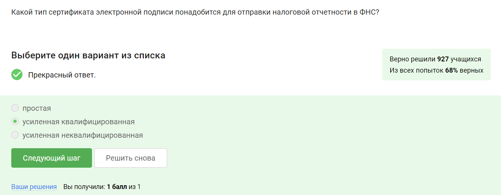
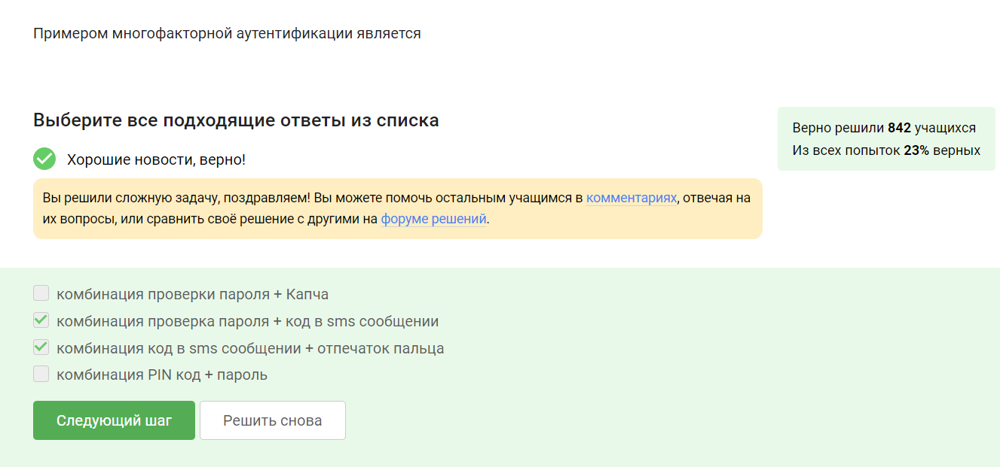

---
## Front matter
title: "Прохождение внешних курсов"
subtitle: "Дисциплина: Основы информационной безопасности"
author: "Дудырев Глеб Андреевич НПИбд-01-22"

## Generic otions
lang: ru-RU
toc-title: "Содержание"

## Bibliography
bibliography: bib/cite.bib
csl: pandoc/csl/gost-r-7-0-5-2008-numeric.csl

## Pdf output format
toc: true # Table of contents
toc-depth: 2
lof: true # List of figures
lot: true # List of tables
fontsize: 12pt
linestretch: 1.5
papersize: a4
documentclass: scrreprt
## I18n polyglossia
polyglossia-lang:
  name: russian
polyglossia-otherlangs:
  name: english
## I18n babel
babel-lang: russian
babel-otherlangs: english
## Fonts
mainfont: Arial
romanfont: Arial
sansfont: Arial
monofont: Arial
mainfontoptions: Ligatures=TeX
romanfontoptions: Ligatures=TeX
sansfontoptions: Ligatures=TeX,Scale=MatchLowercase
monofontoptions: Scale=MatchLowercase,Scale=0.9
## Biblatex
biblatex: true
biblio-style: "gost-numeric"
biblatexoptions:
  - parentracker=true
  - backend=biber
  - hyperref=auto
  - language=auto
  - autolang=other*
  - citestyle=gost-numeric
## Pandoc-crossref LaTeX customization
figureTitle: "Рис."
tableTitle: "Таблица"
listingTitle: "Листинг"
lofTitle: "Список иллюстраций"
lotTitle: "Список таблиц"
lolTitle: "Листинги"
## Misc options
indent: true
header-includes:
  - \usepackage{indentfirst}
  - \usepackage{float} # keep figures where there are in the text
  - \floatplacement{figure}{H} # keep figures where there are in the text
---

# Цель работы

Познакомиться с основами кибербезопасности

# Безопасность в сети

## Как работает интернет базовые сетевые протоколы

1. Протоколом прикладного уровня является протокол HTTPS, он отвечает за работу с приложениями. (рис. [-@fig:001])

{ #fig:001 width=70% }

2. Протокол TCP отвечает за передачу данных внутри одной машины, следовательно, он работает на транспортном уровне. (рис. [-@fig:002])

{ #fig:002 width=70% }

3. Адреса IPv4 состает из 4 чисел от 0 до 255. (рис. [-@fig:003])

{ #fig:003 width=70% }

4. Функцие DNS сервера является: соспоставить доменный и IP адреса. (рис. [-@fig:004])

{ #fig:004 width=70% }

5. Модель TCP/IP состоит из следующих уровней: прикладной(работа с приложением) - траспортный(передача информации внутри машины) - сетевой(передача информации по сети) - канальный(работа с информацией на физическом уровне). (рис. [-@fig:005])

{ #fig:005 width=70% }

6. Протокол HTTP предполагает передачу данных в открытом виде, а протокол HTTPS, который использует TLS, передает зашифрованные даннные. (рис. [-@fig:006])

{ #fig:006 width=70% }

7. Так как http не использует TLS при передаче данных, то этот протокол состоит из двух фаз: рукопожатие и передача данных. (рис. [-@fig:007])

{ #fig:007 width=70% }

8. Версию TLS клиент и сервер определяют во время 'переговоров'. (рис. [-@fig:008])

{ #fig:008 width=70% }

9. В протоколе TLS шифрование данных предусмотрено в фазе: "Данных" (рис. [-@fig:009])

{ #fig:009 width=70% }

## Персонализация сети

1. Куки хранят id пользователя и id сессии, а также информацию о действиях пользователя на сайте. (рис. [-@fig:010])

{ #fig:0010 width=70% }

2. Куки не используются для улучшения надежности соединения, они служат для того, чтобы сохранять информацию о сессии на сервере. (рис. [-@fig:011])

{ #fig:0011 width=70% }

3. Сервер генерирует куки и возвращает их вместе с ответом на запрос. (рис. [-@fig:012])

{ #fig:0012 width=70% }

4. Куки бывают сессионные и постоянные, первые хранятся на сервере и удаляются после закрытия сайта. (рис. [-@fig:013])

{ #fig:013 width=70% }

## Браузер TOR. Анонимизация

1. В луковой маршрутизации существует три узла: охранный, промежуточный и выходной. (рис. [-@fig:014])

{ #fig:014 width=70% }

2. В луковой маршрутизации IP адрес получателя известен: отправителю и выходному узлу. (рис. [-@fig:015])

{ #fig:015 width=70% }

3. Отправитель генерирует три общих секретных ключа: для охранного узла, для промежуточного и для выходного. (рис. [-@fig:016])

{ #fig:016 width=70% }

4. Браузер Tor используется для анонимизации, а не для гарантии успешного получения пакетов. (рис. [-@fig:017])

{ #fig:017 width=70% }

## Беспроводные сети Wi-fi

1. Wi-fi - это технология беспроводной локальной сети, работающая в соответствии со стандартом IEEE 802.11. (рис. [-@fig:018])

{ #fig:018 width=70% }

2. Протокол Wi-fi работает на самом низком канальном уровне, как Ethernet. (рис. [-@fig:019])

{ #fig:019 width=70% }

3. WEP является небезопасным методом шифрования, так как имеет очень короткую длину ключа. (рис. [-@fig:020])

{ #fig:020 width=70% }

4. Данные между хостом сети и роутером передаются в зашифрованном виде, после аутентификации, чтобы их нельзя было перехватить. (рис. [-@fig:021])

{ #fig:021 width=70% }

5. Для домашней сети для аутентификации обычно используется метод Personal(подключение по поролю), второй метод используется для больших корпоративных сетей, он проверяет есть ли пользователь в базе данных. (рис. [-@fig:022])

{ #fig:022 width=70% }

# Защита ПК/телефона

## Шифрование диска

1. Можно зашифровать любой сектор диска. (рис. [-@fig:023])

{ #fig:023 width=70% }

2. Для шифрования диска используется симметричное шифрование, то есть один секретный ключ для шифрования и дешифрования данных. (рис. [-@fig:024])

{ #fig:024 width=70% }

3. BitLocker - для Windows, в Linux – LUKS, в MacOS – это FileVault. (рис. [-@fig:025])

{ #fig:025 width=70% }

## Пароли

1. Стойкий пароль не должен быть коротким и должен состоять из различных символов, букв разного регистра и цифр. (рис. [-@fig:026])

{ #fig:026 width=70% }

2. Пароли необзодимо хранить в безопасном месте, чтобы их не смогли обнаружить случайно, например, в менеджерах для паролей. (рис. [-@fig:027])

{ #fig:027 width=70% }

3. Капча используется для предотвращения запросов к серверу со стороны ботов, что затрудняет автоматизированный перебор паролей. (рис. [-@fig:028])

{ #fig:028 width=70% }

4. Хэширование паролей используется серверами, чтобы не хранить пароль в открытом виде, а вместо него хранить результат применения хэш-функции к паролю. (рис. [-@fig:029])

{ #fig:029 width=70% }

5. Ответ нет, так как соль используется для того, чтобы не хранить результат хэширования часто используемого пароля, так как если злоумышленник получит доступ к серверу, где хранятся хэш-пароли, он сразу поймет прообраз хэширования. (рис. [-@fig:030])

{ #fig:030 width=70% }

6. От атак перебором помогают следующие действия: капча, длинные и сложные пароли, различные пароли, переодическая смена паролей. (рис. [-@fig:031])

{ #fig:031 width=70% }

## Фишинг

1. В данном задании рассматривается такой тип фишинговых атак, как адресный фишинг, когда мы вроде бы переходим на известную нам страницу, но она является поддельной. (рис. [-@fig:032])

{ #fig:032 width=70% }

2. Да такое возможно, это называет спуфинг, это происходит, потому что SMTP не включает в себя проверку адреса отправителя. (рис. [-@fig:033])

{ #fig:033 width=70% }

## Вирусы. Примеры

1. Email спуфинг - это подмена адреса отправителя в емайлах. (рис. [-@fig:034])

{ #fig:034 width=70% }

2. Троян - это вирус, который маскируется под легитимное ПО. (рис. [-@fig:035])

{ #fig:035 width=70% }

## Безопасность мессенджеров

1. В протоколе мессенджеров Signal ключ формируется при генерации первого сообщения строной-отправителем. (рис. [-@fig:036])

{ #fig:036 width=70% }

2. Суть сквозного шифрования состоит в том, что отправитель передает на сервер уже зашифрованное сообщение, сервер отправляет шифрованные данные получателю, а тот их дешифрует, таким образом сервер значет только куда надо передать сообщение. (рис. [-@fig:037])

{ #fig:037 width=70% }

# Криптография на практике

## Введение в криптографию

1. В асимметричных криптографических примитивах обе стороны имеют пару ключей - публичный и секретный. (рис. [-@fig:038])

{ #fig:038 width=70% }

2. Криптографическая хэш-функция обладает следующими свойствами: возвращает последовательность бит фиксированной длинны, устойчива к коллизиям и эффективно вычисляется. (рис. [-@fig:039])

{ #fig:039 width=70% }

3. К алгоритмам цифровой подписи относятся: RSA, американский стандарт ECDSA, российский стандарт ГОСТ Р 34.10-2012. (рис. [-@fig:040])

{ #fig:040 width=70% }

4. Код аутентификации сообщения относится к симметричным примитивам. (рис. [-@fig:041])

{ #fig:041 width=70% }

5. Обмен ключам Диффи-Хэллмана - это ассиметричный примитив, который используется для генерации общего секретного ключа. (рис. [-@fig:042])

{ #fig:042 width=70% }

## Цифровая подпись

1. Протокол электронной цифровой подписи относится к ассиметричным протоколам, то есть с публичным и секретным ключами. (рис. [-@fig:043])

{ #fig:043 width=70% }

2. Алгоритм верификации электронной цифровой подписи требует на вход три вещи - это подпись, сообщение и открытый ключ. (рис. [-@fig:044])

{ #fig:044 width=70% }

3. Электронная цифровая подпись не обеспечивает конфиденциальности - она используется для аутентификации, проверки на целостность и неотказ от авторства. (рис. [-@fig:045])

{ #fig:045 width=70% }

4. Для отправки налоговой отчетности в ФНС необходимо использовать усиленную квалифицированную подпись. (рис. [-@fig:046])

{ #fig:046 width=70% }

5. Квалифицированный сертификат можно получить в сертификационном центре. (рис. [-@fig:047])

{ #fig:047 width=70% }

## Электронные платежи

1. Выбираем платежные системы MasterCard и МИР. (рис. [-@fig:048])

{ #fig:048 width=70% }

2. Примером многофакторной аутентификации является те, что я выбрал. (рис. [-@fig:049])

{ #fig:049 width=70% }

3. При онлайн платежах сегодня используется многофакторная аутентификация покупателя перед банком-эмитентом. (рис. [-@fig:050])

{ #fig:050 width=70% }

## Блокчейн

1. В доказательстве работы используется сложность вычисления прообраза хэш-функции, так как единственным эффективным способом атаки на хэш-функцию является перебор. (рис. [-@fig:051])

{ #fig:051 width=70% }

2. Консенсус в некоторых системах блокчейн обладает свойствами - живучесть, консенсус, постоянства, открытость. (рис. [-@fig:052])

{ #fig:052 width=70% }

3. Участники блокчейна хранят секретные ключи электронной подписи, которые используют для подписи транзакций. (рис. [-@fig:053])

{ #fig:053 width=70% }

# Выводы

Были изучены основы кибербезопасности.

